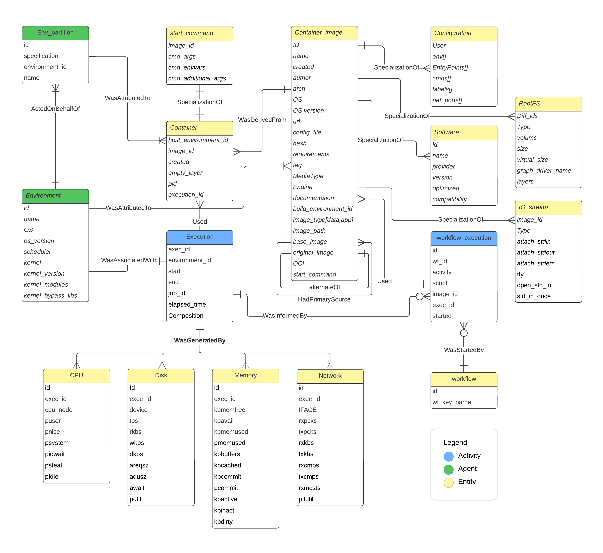

# ProvDeploy

[](https://doi.org/10.5281/zenodo.15334286)
Hello, thanks for visiting ProvDeploy repository

ProvDeploy is a tool to ease deployment and provenance data capture through containers allowing multiple containerization strategies.

## Table of contents


## Getting Started

Please clone ProvDeploy in your local machine by running the following command:

```
git clone https://github.com/nevesLiliane/provDeploy.git
```


## Software Requirements
The requirements to use ProvDeploy are the following:

- [Python](https://www.python.org/) 2 or newer
- [Singularity](https://docs.sylabs.io/guides/3.5/user-guide/introduction.html) > 3.8 or [Apptainer](https://apptainer.org/) > 1.0
- [pymonetdb](https://pypi.org/project/pymonetdb/), [paramiko](https://www.paramiko.org/)

## Installation

ProvDeploy does not need installation, if the requirements are met you can run ProvDeploy through Python.

## Overview of software components with initialization

## How to use

This version of ProvDeploy allows for the following commands:
### Execute a workflow 
To execute a workflow with ProvDeploy you need to provide a workflow description file in a JSON file, then you should run

```
python script.py -s <your_json_file> 
``` 

In a example workflow where we have n activities executed by `script1.py,..., scriptn.py`, that are are called respectively. The JSON file provided should have one of the following structures.

- For coarse-grained execution:
```
{"workflow" : <workflow_tag>,
"act": [{"code":"script1.py","exec_command":<script_1_execution_command>},
	{"code":"script2.py","exec_command":<script_2_execution_command_from_script_1>},
	...
	{"code":"scriptn.py","exec_command":<script_n_execution_command_from_script_n>}],
"path":<workflow_directory>,
"exec_command":<script_1_execution_command>,
"image":<catalog_image_flag>,
"machine" : <execution_environment>
}

```

- For hybrid execution:
```
{"workflow" : <workflow_tag>,
"act": [{"code":["script1.py",...,"script(n-m).py"],"image": <catalog_image_flag>,"exec_command":<script_1_execution_command>},
	...
	{"code": ["script(n-m+1).py" ,...,"scriptn.py"],"image": <catalog_image_flag>,"exec_command": <script_n-m+1_execution_command>}],
"path":<workflow_directory>,
"machine" : <execution_environment>
}
```
- For fine-grained execution:
```
{"workflow" : <workflow_tag>,
"act": [{"code":"script1.py","image":<catalog_image_flag>,"exec_command":<script_1_execution_command>},
	...
	{"code":"scriptn.py","image":<catalog_image_flag>,"exec_command":<script_n_execution_command>}],
"path":<workflow_directory>,
"machine" :<execution_environment>
}
```

In directory `Example_provDeploy`, we provide scripts of example for each strategy. The parameters of the json, are :

 - `workflow` - the identifier of the workflow, this field will be used to connect workflow provenance and container provenance;
 - `act` - the list of activities of the workflow, grouped by common containers(in case of hybrid strategies), this can be a list where each entry is field with two or three parameters: 
 	- `code` - the script or executable bundle to be called by the container, in the case of hybrid strategies, the first in the list is called and the last will be changed by ProvDeploy to execute the next activity with containers;  
  	- `exec_command` - how the activity is expected to be executed in the workflow.  
  	- `image` - the flag that identifies the image in ProvDeploy catalog, in the case of coarse-grained strategies, this key is expected to be placed outside of `act`, since the imame is the same for the whole workflow;    
 - `path` - the directory of the workflow, ProvDeploy will copy the content of this directory to ProvDeploy working directory;  
 - `machine` - the execution environment to be used by ProvDeploy, the default option for this is `local`, that exectutes in the local machine, but the user can add other environments for deployment. If the user choses a external execution environment, ProvDeploy will transfer the workflow and the containers to this environment but it will not try to execute. 
 

### List the containers in the catalog

To list the container configurations in the catalog : 

```
python script.py -l 

``` 

### Access data
To access the database : 

```
python script.py -a <option> 
```
 where `<option>` is `provenance` for workflow provenance and `container` for container provenance. 
 

### Add a new image to the catalog
 : 

```
python script.py -n <your_json_file> 
```
 where `<your_json_file>` is a file with the following characteristics for Singularity Images. 
 

```
{ 
	"new_conf": [
		{
			"name" : "<catalog_image_flag>",
			"path": "path/to/image",
			"filename":"<image_name>.sif", #this is for singularity images
			"description" : "The description in the catalog",
			"runcommand" : "<the default command for to execute the image>", #ex: "./image.sif python"
			"url":"<repository url>", # can be filled with none value
			"tag": "<registry_tag>",
			"vendor": "<docker_or_singularity>",
			"type" : "<type_of_image>"
		}
	
	]
}

```

where:

 - `type_of_image` - refers to the type of image that cam be: `app` for application containers, `prov` for provenance services and `data` for DBMSs.

### Container aware provenance data model
ProvDeploy implements a W3C Prov compliant data model to represent container provenance. You can access an dump file of this data model at this [link](https://bitbucket.org/lilianeKunstmann/provdeploy/src/master/server/recipes/database/DfAnalyzer/monetdb/sql/provdeploy-schema.sql)


{width=32%}


## Deployment


## Examples

ProvDeploy is on directory server and there is an example in the directory `server/Example_provDeploy` where you can run Alexnet with provenance.
To execute the example run:

```python script.py -s Example_provDeploy/submit.json ```


## License

## Presentation video

## Contributor

Liliane Kunstmann(*nee* Neves) - lneves@cos.ufrj.br

## Publications
 - [Kunstmann, L., Pina, D., de Oliveira, D., & Mattoso, M. (2024).  Scientific Workflow Deployment: Container Provenance in High-Performance Computing. In Anais do XXXIX Simpósio Brasileiro de Bancos de Dados, outubro 14, 2024, Florianópolis/SC, Brasil. SBC, Porto Alegre, Brasil, 457-470. DOI:  https://doi.org/10.5753/sbbd.2024.240194.](https://sol.sbc.org.br/index.php/sbbd/article/view/30713/30516)(Best paper award)
 
 - [Kunstmann, L., Pina, D., de Oliveira, D., & Mattoso, M. (2024). ProvDeploy: Provenance-oriented Containerization of High Performance Computing Scientific Workflows. arXiv preprint arXiv:2403.15324.](https://arxiv.org/pdf/2403.15324.pdf)
 
- [Kunstmann, L., Pina, D., de Oliveira, L. S., de Oliveira, D., & Mattoso, M. (2022, October). ProvDeploy: Explorando Alternativas de Conteinerização com Proveniência para Aplicações Científicas com PAD. In Anais do XXIII Simpósio em Sistemas Computacionais de Alto Desempenho (pp. 49-60). SBC.](https://sol.sbc.org.br/index.php/wscad/article/view/21932/21755)

- [Neves, L., Pina, D., de Oliveira, D., & Mattoso, M. (2020, November). Apoio à Utilização de Análise de Dados em Aplicações CSE por meio de Contêineres. In Anais da VI Escola Regional de Alto Desempenho do Rio de Janeiro (pp. 26-30). SBC.](https://sol.sbc.org.br/index.php/eradrj/article/view/14512/14358)(Best paper award)

## Acknowledgements 

The author expresses her gratitude for [Rodrigo Alves Prado da Silva](https://www.researchgate.net/profile/Rodrigo-Silva-102) guidance in Singularity and the initial development insights in the first version of ProvDeploy.

